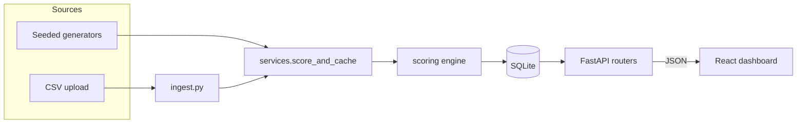

# Architecture

How Undercurrent is put together, and — more usefully — *why*. This is the
document to read before changing the code, and the one that mirrors how I'd walk
through the project in an interview.

- [The shape of the system](#the-shape-of-the-system)
- [The journey of a transaction](#the-journey-of-a-transaction)
- [Backend layers](#backend-layers)
- [The scoring engine](#the-scoring-engine)
- [The connector seam](#the-connector-seam)
- [Frontend](#frontend)
- [Key design decisions](#key-design-decisions)
- [How to extend it](#how-to-extend-it)

---

## The shape of the system

A small two-tier app: a Python scoring service and a React dashboard, with
SQLite as the store.



The important structural fact: **the scoring engine sits at the center and knows
nothing about HTTP, the ORM, or where transactions came from.** It takes plain
DataFrames and returns a plain result object. Everything else — persistence, the
API, the UI, the CSV parser — is arranged around that core so the interesting
logic stays isolated and testable.

---

## The journey of a transaction

The clearest way to understand the codebase is to follow one transaction from
raw input to a rendered score.

1. **Ingress.** A transaction enters as either a seeded generator row
   ([`generators.py`](backend/app/generators.py)) or a row in an uploaded CSV
   ([`ingest.py`](backend/app/ingest.py) via the
   [`CsvSource`](backend/app/sources/csv_source.py) adapter). Both normalize to
   the same ledger schema: `txn_date, amount (signed), direction, category,
   kind, counterparty`.

2. **Persistence.** Rows are written to the `transactions` table
   ([`models.py`](backend/app/models.py)). No running balance is ever
   stored — balances are always recomputed by cumulatively summing signed
   amounts, so the ledger is the single source of truth and can't drift.

3. **Aggregation.** [`scoring/engine.py`](backend/app/scoring/engine.py)'s
   `prepare_monthly()` rolls the ledger into one row per month: revenue,
   operating expense, loan payment, total outflow, end-of-month balance.

4. **Scoring.** The six factors ([`scoring/factors.py`](backend/app/scoring/factors.py))
   each read the monthly frame and return a 0–100 sub-score plus a plain-English
   explanation. `score_business()` renormalizes their weights over whichever
   factors apply and rolls up to an overall score, grade, risk tier, and an
   Approve/Review/Decline recommendation.

5. **Caching.** [`services.py`](backend/app/services.py)'s `score_and_cache()`
   writes the result to `score_runs` + `score_factors` so the API serves it
   instantly. Both the seed script and the upload endpoint call this one
   function — the scoring path is identical whether the data was generated or
   uploaded.

6. **Serving.** [`routers/businesses.py`](backend/app/routers/businesses.py)
   reads the cached score and rebuilds the monthly cash-flow series for the
   chart, shaping both into the JSON contract in
   [`schemas.py`](backend/app/schemas.py).

7. **Rendering.** The React app fetches that JSON and renders the gauge, chart,
   and factor breakdown.

---

## Backend layers

Each module has one job. The names are the ones a FastAPI developer expects, so
the layout is legible at a glance.

| Layer | File(s) | Responsibility |
| --- | --- | --- |
| Config/DB | `database.py` | Engine, session, `Base`, the `get_db` dependency |
| Persistence | `models.py` | SQLAlchemy tables (ledger-as-source-of-truth) |
| API contract | `schemas.py` | Pydantic response shapes (deliberately ≠ the DB models) |
| Ingress | `generators.py`, `ingest.py`, `sources/` | Produce normalized ledger rows |
| Domain | `scoring/` | The framework-free scoring engine |
| Service | `services.py` | "Ledger in DB → cached score" (shared by seed + upload) |
| API | `routers/` | HTTP endpoints |
| Entry | `main.py`, `seed.py` | App wiring; DB rebuild script |

Two idioms worth calling out:

- **`models` vs `schemas` is a deliberate split.** The database shape and the
  API shape are different on purpose — the API hides internal columns and
  reshapes data. Keeping them apart stops the two concerns from bleeding
  together (a classic FastAPI pattern).
- **The service layer exists to avoid duplication.** Seeding and uploading both
  need the identical "persist ledger → score → cache" step, so it lives once in
  `services.score_and_cache()` rather than being copy-pasted into two callers.

---

## The scoring engine

`scoring/` is the intellectual core and the one package that imports **no web
framework and no ORM**. It's four files that read like a sentence:

- **`config.py`** — the tunable knobs: factor weights, grade bands, the lookback
  window. Everything a reviewer might challenge lives here, not buried in the
  math, so the model is auditable.
- **`decompose.py`** — classical additive time-series decomposition
  (`observed = trend + seasonal + residual`), implemented from scratch to keep
  the method transparent and the dependency list small. Also houses
  `predictability_cv()`, the out-of-sample stability measure.
- **`factors.py`** — the six factor functions, each a small pure function
  returning a `FactorResult`.
- **`engine.py`** — orchestration: aggregate the ledger, run the factors,
  renormalize weights, roll up the grade.

**The fairness thesis, in code:** a naive model penalizes *any* revenue
variability. Undercurrent instead decomposes the series and judges only the
pieces that signal risk — the **trend** and the *unpredictable* residual — while
ignoring predictable **seasonality**. Stability is measured **out-of-sample**
(does one year's monthly shape predict the next?), which is what lets the model
tell a wildly-seasonal-but-predictable business (a Halloween pop-up) apart from a
genuinely erratic one (a pre-PMF startup). Coverage metrics are measured at the
seasonal **trough**, not the average month.

The six factors and default weights (renormalized over whichever apply):

| Factor | Weight | Measures |
| --- | --- | --- |
| Cash runway (trough) | 25 | Months of expenses covered by cash at the seasonal low |
| Revenue stability | 20 | Out-of-sample unpredictability of the monthly shape |
| Growth trend | 15 | Direction of deseasonalized revenue |
| Debt-service coverage | 15 | Operating cash flow ÷ scheduled loan payments |
| Receivables health | 15 | DSO + overdue share (invoice businesses only) |
| Expense flexibility | 10 | How much costs flex down when revenue falls |

Every factor returns a raw metric, a direction (helped/hurt/neutral), and a
sentence — that's what powers the "Why this score" panel. The test suite
([`tests/test_scoring.py`](backend/tests/test_scoring.py)) encodes the thesis
directly: a naive volatility model scores the seasonal series below 40; this
model scores it above 80.

---

## The connector seam

Uploads flow through an explicit integration seam
([`sources/`](backend/app/sources/)) rather than being wired straight into the
endpoint. A `TransactionSource` is anything that can `load()` a normalized
ledger; `CsvSource` is the first implementation.

```
TransactionSource (abstract)      # base.py — the contract + validated()
   └── CsvSource                  # csv_source.py — wraps ingest.py
   └── PlaidSource   (future)     # a bank feed
   └── QuickBooksSource (future)  # an accounting export
```

The seam is the design statement: in production this platform would ingest from
Plaid, an accounting package, or a POS system, and each is just a `load()`
implementation plus its own auth — nothing downstream changes. The contract is
enforced at the boundary (`validated()` checks the schema and transaction
kinds), so a misbehaving connector fails loudly instead of corrupting scores.
That's why "upload a CSV" is an honest stand-in for a real bank integration: it
runs the exact same path a `PlaidSource` would.

`ingest.py` itself is deliberately forgiving — flexible header matching, currency
cleanup (`$1,234.56`, `(500)` negatives), optional `category` with sign-based
inference, and a conservative keyword pass that flags loan payments on bare bank
exports. Errors are user-facing (`"Row 17: could not parse date ..."`), which is
the point: gracefully handling messy real-world exports *is* the feature.

---

## Frontend

A lean React + Vite SPA; no router or state library.

- **`App.jsx`** — top-level state, data fetching, and the shell (top bar +
  slide-out drawer). Routing is **hash-based** (`#/`, `#/about`,
  `#/business/12`) with the URL as the single source of truth, so the browser's
  back/forward buttons, refresh, and deep links all work without a router
  dependency.
- **`components/`** — presentational building blocks: `HomePage` (hero + live
  portfolio stats), `AboutPage` (the methodology, in-app), the `Dashboard`
  pieces (`ScoreGauge`, `CashflowChart`, `FactorBreakdown`), and `UploadPanel`.
- **`api.js`** — the only place that talks to the backend. **`theme.js`** — the
  shared color/format language, so grades and recommendations are colored
  identically everywhere. **`index.css`** — design tokens + component styles.

Vite proxies `/api` to the backend in dev, so the frontend carries no absolute
URLs.

---

## Key design decisions

The trade-offs an interviewer is likely to probe:

1. **The scoring core is framework-free.** Plain DataFrames in, plain object
   out. This is what makes the interesting logic trivially unit-testable and
   swappable — and it's why the CSV path and the seed path share it for free.

2. **The ledger is the only source of truth.** No stored balances. Every balance
   is a cumulative sum, so the data can't drift out of sync with itself.

3. **Fairness comes from method, not exceptions.** No industry gets hard-coded
   leniency. The same decomposition treats every business; a landscaper and a
   SaaS company are scored by identical math. This is the defensible version of
   the pitch — the alternative (special-casing seasonal industries) wouldn't
   survive scrutiny.

4. **Scores are cached at seed time.** A deliberate simplification with a known
   cost: editing the scoring code requires a re-seed, or the API serves stale
   numbers (documented in the README's Known Limitations). Uploads sidestep this
   by scoring on demand through the same service.

5. **Two years of lookback, not one.** The seasonal decomposition needs ≥2
   cycles to separate a trend from a season; with only 12 months they're
   mathematically indistinguishable. (This was a real bug the codebase caught
   and fixed.)

6. **Determinism everywhere.** Every generator uses a seeded RNG, so `clone →
   seed` produces byte-identical scores for everyone. Timestamps are fixed, not
   wall-clock.

---

## How to extend it

- **Add a business profile** — write a generator (or a spec for the
  `_make_seasonal` / `_make_steady` builders) in `generators.py`, add it to
  `all_businesses()`, and re-seed.
- **Add a real connector** — implement `TransactionSource.load()` in a new
  `sources/` module (e.g. `PlaidSource`) returning the normalized schema, then
  point an endpoint at it. Nothing in `scoring/` changes.
- **Retune the model** — every weight and threshold is in `scoring/config.py`
  and `scoring/factors.py`. Re-seed to recompute.
- **Make scores live** — the highest-value next step: add a
  `POST /api/businesses/{id}/score` recompute endpoint (the scoring is already a
  pure function; this just calls `score_and_cache` on demand) and have the seed
  reuse it. Removes the stale-cache footgun.

---

_Undercurrent is a portfolio demonstration. Sample businesses are fictional,
scores are computed from generated or uploaded transaction data, and nothing
here is a real credit decision._
