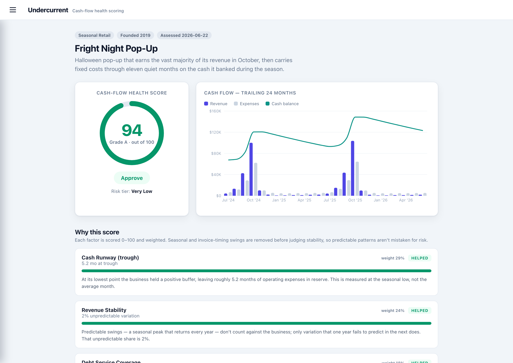

# Undercurrent

_Underwriting the current beneath the noise._

**Undercurrent** is an explainable small-business creditworthiness tool that scores a business from
its **transaction-level cash flow** — the kind of alternative data a modern
lender pulls from Plaid or an accounting integration — instead of a traditional
credit-bureau score.

> **Portfolio demo, not a lending product.** There are no real bank or
> accounting integrations and no real credit decisions. Every business is
> fictional and every transaction is generated by a seeded mock-data generator.



_Above: a Halloween pop-up that earns ~all of its revenue in a single month —
exactly the profile a naive model rejects as "unstable" — scores **94 / A /
Approve**, because Undercurrent judges the whole cycle: the seasonal spike is
predictable, and the business banks it to cover 5+ months of runway at the
trough._

---

## The problem this solves

Most automated underwriting implicitly assumes **smooth, recurring revenue** —
the SaaS-style income curve. That assumption quietly penalizes two large,
perfectly healthy categories of small business:

- **Seasonal businesses** (landscaping, holiday retail, tourism) earn almost
  nothing for months at a time. A model that treats revenue *variability* as
  risk sees a landscaper's near-zero January and flags instability — even though
  the pattern repeats like clockwork every year.
- **Invoice-driven businesses** (agencies, contractors, wholesalers) get paid in
  lumps, 30–90 days after the work is done. Their bank feed looks "volatile" and
  frequently dips toward zero between collections, even when every invoice is
  ultimately paid.

The result is that creditworthy seasonal and invoice-based businesses get
under-scored or declined, purely because their revenue *shape* doesn't match the
model's assumptions.

## How this tool addresses it

The fix isn't to hard-code leniency for certain industries — that isn't
defensible. It's **methodological**: every monthly cash-flow series is
decomposed into

```
observed = trend + seasonal + residual
```

and the scoring factors judge the pieces that actually signal risk — the
**trend** (is the business growing or shrinking?) and the *unpredictable*
variation — while ignoring the piece that is merely predictable (the
**seasonal** swing). Coverage metrics like runway are measured across the whole
cycle, at the seasonal *trough*, rather than month-to-month.

Crucially, "unpredictable" is measured **out-of-sample**: does one year's
monthly shape actually predict the next year's? A seasonal peak that returns
every year is predictable and doesn't count against the business; revenue that
lurches around with no repeatable pattern does. (This matters — a naive
"leftover residual" measure overfits badly with only ~2 years of data and would
let a business with pure-noise revenue masquerade as rock-steady. The
cross-validated version is what lets the model tell a *seasonal* extreme apart
from a genuinely *erratic* one, which is the whole game.)

So a landscaper isn't penalized for its winter, and an agency isn't penalized
for lumpy-but-reliable collections. A business is only marked down for things
that genuinely indicate risk: a declining underlying trend, a thin cash cushion
at its low point, chronically overdue receivables, or debt it can't cover.

The scoring test suite encodes this claim directly: `test_scoring.py` proves that
a naive raw-volatility model would score a seasonal business below 40, while this
model scores the same series above 80.

---

## Scoring methodology

Six explainable factors, each mapped to a 0–100 sub-score against published
benchmark thresholds (no fitted coefficients, nothing hidden), then weighted:

| Factor | Weight | What it measures |
| --- | --- | --- |
| **Cash runway (trough)** | 25 | Months of expenses covered by cash at the seasonal low point — surviving the trough is what actually kills these businesses |
| **Revenue stability** | 20 | Out-of-sample *unpredictability*: how badly one year's monthly shape fails to predict the next (predictable seasonality doesn't count) |
| **Growth trend** | 15 | Direction of the deseasonalized revenue line — growing, flat, or eroding |
| **Debt-service coverage** | 15 | Operating cash flow ÷ scheduled loan payments (DSCR) |
| **Receivables health** | 15 | Days-sales-outstanding and share of overdue invoices (invoice businesses only) |
| **Expense flexibility** | 10 | How much costs flex down when revenue falls |

Weights are **renormalized over the factors that apply** — a cash-only business
has no receivables, so that factor is dropped and its weight is redistributed
rather than granting a free pass.

The weighted total maps to a letter grade, a risk tier, and an
**Approve / Review / Decline** recommendation:

| Score | Grade | Risk tier | Recommendation |
| --- | --- | --- | --- |
| 90–100 | A | Very Low | Approve |
| 80–89 | B | Low | Approve |
| 70–79 | C | Moderate | Review |
| 60–69 | D | Elevated | Review |
| < 60 | F | High | Decline |

The familiar A/B/C/D/**F** scale — no "E" (a bottom grade of F reads
unambiguously as "fail"). Each band is split into **+/- thirds** for finer
resolution (A+ … F), so the letter carries more signal than five buckets would;
F is left plain, as on a report card. The risk tier and recommendation follow
the base letter.

Every factor returns not just a number but a **plain-English explanation** of
why it landed where it did — that breakdown is the centerpiece of the dashboard.

### The thirty sample businesses

Thirty fictional businesses, **eighteen of them seasonal**, spanning the full
A → F range. The point of loading the set with seasonal businesses is to make
one thing unmistakable: **seasonality is never the risk signal — management is.**
Seasonal businesses show up at *every* grade, sitting right next to their
non-seasonal peers.

The grading is deliberately **strict** — an A is rare, reserved for genuinely
exceptional coverage (≈5 months of runway at the trough), so the distribution
discriminates instead of rubber-stamping. Grade distribution (13 hand-written
profiles + 17 generated from
[`generators.py`](backend/app/generators.py) specs):

| Grade band | Verdict | Count | Examples |
| --- | --- | --- | --- |
| A / A- | Approve | 8 | Big Bang Fireworks, Bayside Marina, Northwind (SaaS), Fright Night, Evergreen Landscaping |
| B+ / B / B- | Approve | 10 | **Wonder Junction Amusement Park**, Ledger & Quill Tax, Summit Peak Ski Resort, Frostbite Ski, Tannenbaum Tree Farm |
| C+ / C- | Review | 2 | Meridian Agency (lumpy collections), Camp Wildwood (concentrated season) |
| D+ / D | Review | 5 | Harbor Street (slow decline), Alpine Snow & Plow, Lakeside Pools, QuickHop Courier, Willow & Vine |
| F | Decline | 5 | Riptide Water Park, Overland Freight, Cliffside Bistro, Stalled Studio, Pivot Labs |

**Seasonal spotlight** — the same "peak-then-trough" shape lands at five
different grades depending only on how the business is run:

| Seasonal business | Grade | What made the difference |
| --- | --- | --- |
| Big Bang Fireworks | **A** | Twin-peak season, strong margins, deeply cushioned — the rare top grade |
| Wonder Junction Amusement Park | **B+** | Big summer/holiday season, healthy margins, well-cushioned for the off-season |
| Summit Peak Ski Resort | **B-** | A *winter*-peaking season — the mirror image of most — scored just as fairly |
| Camp Wildwood | **C-** | Revenue jammed into three months with only a thin off-season cushion |
| Alpine Snow & Plow | **D** | Its season depends on the *weather*, so year-over-year it's genuinely less predictable — the stability factor catches that |
| Lakeside Pools & Patio | **D** | Predictable season, but doesn't bank enough to cover winter — runs thin at the trough |
| Riptide Water Park | **F** | A declining, over-leveraged, thinly-cushioned seasonal business — genuinely in trouble |

Contrast that with the businesses the model *declines*: none are declined for
being seasonal. They fail on a declining trend, a thin trough, debt they can't
cover, uncollectable receivables, or genuinely pattern-less revenue (Pivot Labs,
whose volatility is *unpredictable* — the mirror image of a Halloween pop-up's
*predictable* extremes).

Every business ships with the full factor-by-factor "why this score" breakdown;
switch between them in the dashboard to see how the model treats each fairly.

---

## Upload your own business

The dashboard's **Upload your business** button accepts a transactions CSV —
the format every real bookkeeping surface can produce (QuickBooks/Xero exports,
raw bank-statement downloads, Square exports, hand-kept spreadsheets). The file
is parsed, validated, stored, and **scored on the spot** through the exact same
pipeline as the samples, then lands on the same dashboard. In production this
would be a Plaid or QuickBooks feed; the CSV upload exercises the identical
scoring path.

The parser (`backend/app/ingest.py`) is deliberately forgiving, because messy
input is the whole point:

- **Flexible headers** — "Date" / "Posting Date" / "txn_date" all work; same
  for amount, description, and category.
- **Only two required columns**: a date and a signed amount (positive = money
  in). Currency formatting (`$1,234.56`, parenthesized negatives) is handled.
- **`category` is optional.** With it, your labels drive classification.
  Without it (a bare bank export), inflows are treated as revenue, outflows as
  expenses, and a conservative keyword pass on descriptions ("loan", "SBA",
  "debt service"…) catches loan payments so the debt-service factor still
  works — the same kind of transaction classification real alternative-data
  lenders run on bank feeds.
- **Human errors, not stack traces** — "Row 17: could not parse date
  '13/45/2025'" instead of a 500.

There's a **Download a sample CSV** link in the upload dialog for instant demos,
and a ready-made bank-export-style file at
[`docs/sample-transactions.csv`](docs/sample-transactions.csv) (24 months, no
category column — it exercises the sign-inference and loan-keyword paths; scores
**A- / Approve**). Uploaded businesses are badged in the sidebar and can be
deleted; the 30 samples are protected.

### Where bank/POS connectors would plug in

Ledger ingestion goes through a deliberate seam:
[`app/sources/`](backend/app/sources/) defines a tiny `TransactionSource`
contract — *produce transactions in the platform's normalized schema* — and
`CsvSource` is its first implementation. The upload endpoint, persistence,
scoring, and dashboard consume only that schema and never know where rows came
from.

Adding a real connector (Plaid for bank feeds, QuickBooks/Xero for accounting,
Square for POS) means writing one new `TransactionSource` subclass — auth +
fetch + map to the schema — and nothing else moves. The contract is enforced at
the boundary (`validated()`), so a misbehaving connector fails loudly instead
of corrupting scores. Plaid's free sandbox (fake credentials, real API) is the
natural first target; it should be env-gated so the demo still runs from a bare
`git clone` with no keys.

---

## Machine-learning risk model (learned second opinion)

Alongside the transparent rule-based grade, a trained **gradient-boosting model**
predicts each business's probability of default from the same cash-flow signals —
a learned check on the hand-built rules, shown on every business page with a
per-prediction **SHAP** explanation. Full write-up:
[**docs/MODEL_CARD.md**](docs/MODEL_CARD.md).


The interesting part is the **honest labeled-data pipeline**. Real default
outcomes don't exist for fictional businesses, so
[`app/ml/dataset.py`](backend/app/ml/dataset.py) samples latent fundamentals,
builds a noisy 24-month ledger, and draws each label *stochastically* from a
latent default probability — with two interaction effects a linear model can't
capture. The model sees only noisy ledger estimates, so it can't trivially
re-derive a rule and its accuracy is honestly capped.

| | |
| --- | --- |
| Held-out **ROC-AUC** | **0.85** (5-fold CV 0.830 ± 0.004) |
| Logistic baseline | 0.84 — the boosted model's edge comes from interactions |
| PR-AUC / Brier | 0.65 (base rate 0.21) / 0.11 |
| Top learned features | runway · growth trend · revenue predictability |

That last row is the punchline: **the model independently rediscovered the same
signals the rule engine weights most** — and where it *disagrees* (e.g. it rates
the operationally-profitable-but-overleveraged trucking firm as merely elevated,
not a decline) is exactly the kind of case worth discussing.

Pipeline (`backend/app/ml/`): `features.py` (shared train/serve extractor) →
`dataset.py` (labeled data) → `train.py` (fit + evaluate + SHAP) → `model.py`
(serving). Regenerate with `python -m app.ml.dataset && python -m app.ml.train`.
The endpoint returns **503** (and the UI hides the panel) if the model isn't
trained, so the rest of the app runs without it. An EDA + training walkthrough
lives in [`notebooks/`](notebooks/).

---

## Architecture

> For a full walkthrough — the data flow, the layering, and the design
> decisions behind each — see **[ARCHITECTURE.md](ARCHITECTURE.md)**.

```
backend/                     FastAPI + pandas over SQLite
  app/
    generators.py            Seeded mock-data generators (30 businesses)
    seed.py                  Rebuilds the DB and caches a score per business
    ingest.py                Forgiving CSV parser for uploaded ledgers
    sources/                 TransactionSource seam (CSV today; Plaid/POS drop in here)
    services.py              Shared score-and-cache step (seed + uploads)
    models.py                SQLAlchemy models (ledger-as-source-of-truth)
    scoring/                 Pure, framework-free scoring package
      decompose.py           Additive trend/seasonal/residual decomposition
      factors.py             The six factor computations
      engine.py              Orchestration -> overall score + breakdown
      config.py              Weights + benchmark thresholds (all tunable)
    ml/                      ML risk model (learned second opinion)
      features.py            Shared feature extractor (train == serve)
      dataset.py             Synthetic labeled-data pipeline
      train.py               Fit + evaluate + SHAP -> artifacts/
      model.py               Lazy-loaded serving (probability + SHAP)
    routers/                 REST API (businesses.py, uploads.py)
  tests/                     Scoring fairness + CSV ingestion + ML tests
frontend/                    React (Vite) + Recharts dashboard
```

Design notes worth a walkthrough:

- **The ledger is the single source of truth.** No running balance is ever
  stored; every balance is the cumulative sum of signed transactions, so it
  can't drift.
- **The scoring package imports no web framework and no ORM.** It takes plain
  DataFrames in and returns a plain result object, which keeps the interesting
  logic trivially unit-testable.
- **The decomposition is implemented from scratch** (not pulled from
  statsmodels) to keep the method transparent and the dependency list small.

---

## Running it locally

Prerequisites: **Python 3.11+** and **Node 18+**.

### 1. Backend

```bash
cd backend
python3 -m venv .venv
source .venv/bin/activate
pip install -r requirements.txt

python -m app.seed                       # build cashflow.db + compute scores
uvicorn app.main:app --reload            # API on http://localhost:8000
```

Visit http://localhost:8000/docs for the interactive API docs.

### 2. Frontend

```bash
cd frontend
npm install
npm run dev                              # dashboard on http://localhost:5173
```

The Vite dev server proxies `/api` to the backend, so just open
http://localhost:5173.

### Tests

```bash
cd backend
pip install -r requirements-dev.txt   # adds pytest
python -m pytest
```

---

## Deploy (single service)

In production the **FastAPI process serves the built React app too** — one
service, one origin, no CORS. The [`Dockerfile`](Dockerfile) builds the frontend,
installs the backend, seeds the 30-business database into the image, and runs
uvicorn; the trained ML model artifact is committed, so `/ml` works on boot.

```bash
docker build -t undercurrent .
docker run -p 8000:8000 undercurrent      # open http://localhost:8000
```

Any Docker host works (Render/Railway/Fly free tiers). For Render, the included
[`render.yaml`](render.yaml) makes it a one-click **Blueprint** deploy — push to
GitHub, then *New → Blueprint → this repo*. Health check: `/api/health`. Note the
SQLite DB is baked at build time, so it resets on redeploy (uploads don't
persist across restarts) — fine for a demo, and the seed rebuilds all 30 samples.

---

## Extending it

- **Add a business profile** — write a new generator in `generators.py` and add
  it to `all_businesses()`, then re-seed.
- **Retune the model** — every weight and threshold lives in
  `scoring/config.py` and `scoring/factors.py`; nothing is buried in the math.
- **Swap in real data** — the scoring engine only needs a transactions
  DataFrame and an invoices DataFrame, so a real Plaid/QuickBooks adapter would
  drop in where `seed.py` currently calls the generators.

---

## Known limitations & notes for contributors

- **Sample scores are cached at seed time.** Uploads are scored live at upload
  time, but the 30 samples serve the score rows written by `app.seed`. After
  changing anything in `scoring/`, re-run `python -m app.seed` or the samples
  will show stale numbers. (A live re-score endpoint for samples would remove
  this footgun — a good next step.)
- **Invoice generator has a cold-start ramp.** `gen_invoice()` only issues
  invoices *inside* the 24-month window, so the first ~2 months collect fewer
  matured payments and revenue ramps up artificially. This nudges the agency's
  growth-trend factor upward. Warming up with a few months of pre-window
  invoices (recording only the payments that land in-window) would fix it.
- **Uploads don't support invoices.** The CSV path ingests transactions only,
  so uploaded businesses always have the receivables factor excluded (weight
  redistributed). A second optional invoices CSV would light that factor up.
- **No frontend tests.** Only the scoring engine and CSV ingestion are covered
  by tests (`backend/tests/`). The React layer is unverified beyond manual/CI
  build.
- **Single JS bundle (~550 KB).** Recharts dominates the bundle; fine for a
  demo, but code-splitting or a lighter chart lib would help a real deploy.
- **Dev-only CORS.** `main.py` allows `localhost:5173` only; adjust
  `allow_origins` for any other frontend origin.
