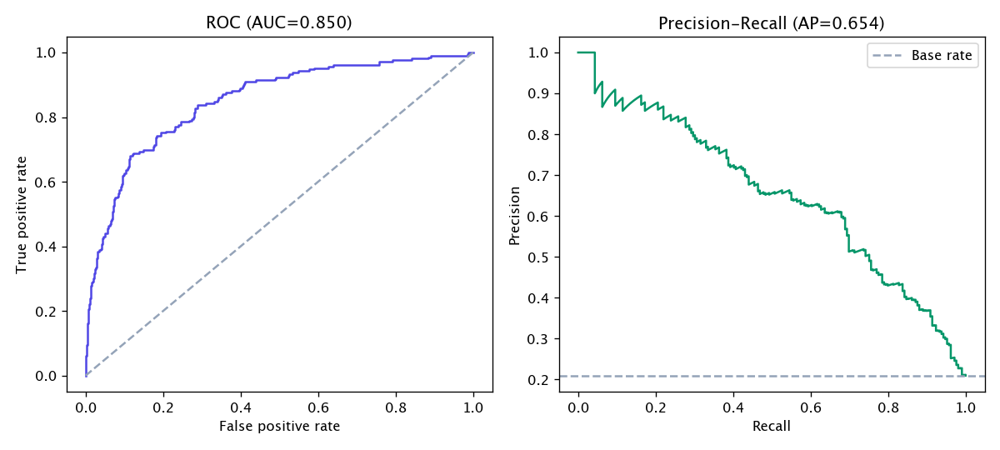
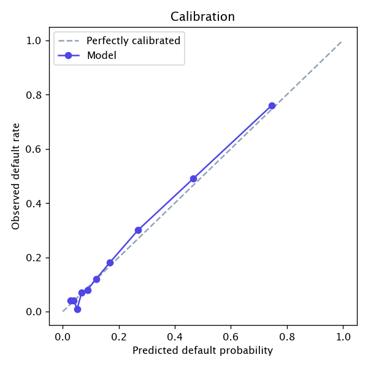
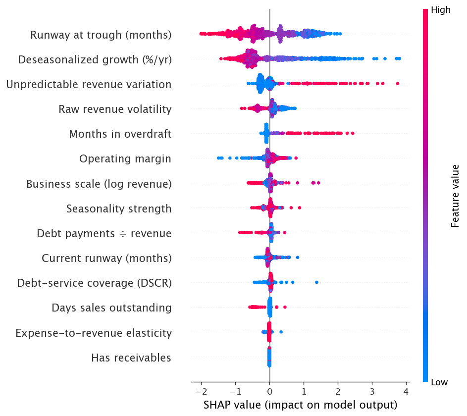

# Model Card — Undercurrent default-risk model

A supervised model that predicts a small business's probability of default from
its cash-flow ledger, serving as a **learned second opinion** alongside the
transparent rule-based Undercurrent score. This card documents the data, the
methodology, the metrics, and — importantly — the limitations.

> **This is a portfolio demonstration of the ML lifecycle, not a real default
> predictor.** Labels are synthetic (see *Data*). It exists to show feature
> engineering, a reproducible labeled-data pipeline, honest evaluation, and
> explainability — not to make credit decisions.

## Intended use

- **Use:** a second-opinion risk probability + SHAP explanation shown next to
  the rule-based grade, to illustrate how a learned model reaches (or diverges
  from) the same conclusions on the same evidence.
- **Not for use:** any real lending, credit, or financial decision. There are no
  real businesses or outcomes here.

## Data

Real default outcomes don't exist for fictional businesses, so
[`app/ml/dataset.py`](../backend/app/ml/dataset.py) manufactures a *defensible*
learning problem rather than a circular one:

1. Sample a business's **latent fundamentals** (trend, margin, leverage,
   cushion, volatility, seasonal archetype) from realistic distributions.
2. Build a **noisy 24-month ledger** from those fundamentals.
3. Draw the **label** from a latent default probability that is a documented
   logistic function of the *clean* fundamentals — **stochastically** (Bernoulli).
   Two identical-looking businesses can land on different outcomes.
4. Extract the model's **features from the noisy ledger**.

The model therefore sees only *noisy estimates* of the fundamentals, and the
label carries irreducible Bernoulli noise — so it can't trivially re-derive a
rule, and accuracy is honestly capped below 100%. The latent function includes
two **interaction terms** (a decline is worse when the cushion is also thin; a
thin margin is worse when also leveraged), which is why a tree model can beat a
linear baseline.

- **Rows:** 4,000 synthetic businesses · **default rate:** ~21% · **split:** 75/25 stratified.

## Features (14)

Engineered by [`app/ml/features.py`](../backend/app/ml/features.py) — the single
extractor used by both training and serving (no train/serve skew). They reuse
the same cash-flow signals the rule engine computes, plus raw aggregates:

`runway_trough_mo`, `current_runway_mo`, `dscr`, `debt_to_revenue`,
`operating_margin`, `revenue_cv`, `predictability_cv`, `trend_pct`,
`expense_rev_corr`, `months_negative`, `seasonality_strength`,
`log_avg_revenue`, `has_receivables`, `dso_days`.

## Model & metrics

Headline model: **GradientBoostingClassifier** (300+ shallow trees). A
standardized **LogisticRegression** is kept as an interpretable baseline.

| Metric | Value |
| --- | --- |
| ROC-AUC (held-out test) | **0.850** |
| ROC-AUC (5-fold CV) | 0.830 ± 0.004 |
| Logistic baseline ROC-AUC | 0.840 |
| PR-AUC (base rate 0.21) | 0.654 |
| Brier score | 0.112 |
| Precision / Recall (default class @0.5) | 0.68 / 0.44 |

The gradient-boosting model beats the linear baseline (0.850 vs 0.840) by
capturing the interaction effects; tight CV variance (±0.004) shows the number
is signal, not noise. Evaluation plots: [`docs/ml/`](ml/) — ROC/PR, calibration,
and a SHAP summary.




## Explainability

Per-prediction **SHAP** values (TreeExplainer) drive both the served explanation
and the global importance ranking. Reassuringly, the learned model's most
important features are the same signals the hand-built rules weight most:

1. Runway at trough · 2. Deseasonalized growth · 3. Unpredictable revenue
variation · 4. Raw revenue volatility · 5. Months in overdraft.



## Limitations

- **Synthetic labels.** The entire supervisory signal is manufactured; metrics
  describe the pipeline's behavior on this synthetic problem, not real default.
- **Distribution = the generator.** The model only sees businesses shaped like
  `dataset.py`'s archetypes; real bank feeds would differ.
- **No fairness/protected-attribute analysis** — there are no people here, but a
  real deployment would require it.
- **Calibration** is decent (Brier 0.11) but not production-grade; a real model
  would add isotonic/Platt calibration and monitoring.

## Reproduce

```bash
cd backend
python -m app.ml.dataset   # regenerate training.csv (deterministic seed)
python -m app.ml.train     # retrain -> artifacts/model.joblib, metrics.json, docs/ml/*.png
```
